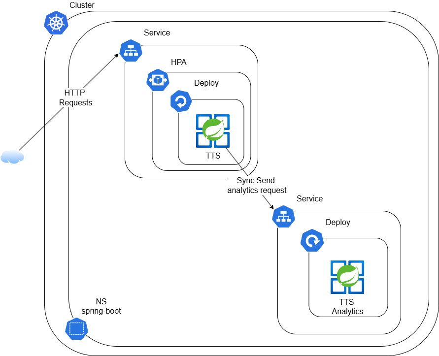

# **Beginner friendly: deploy a Spring Boot application to Kubernetes**
Deploying our applications to Kubernetes may help us with a lot of heavy deploy-related tasks like service discovery and horizontal scaling... With Kubernetes, we don't need to include those concerns in our code, instead those concerns are exported to be handled by Kubernetes.

We are going to deploy two microservices to a Kubernetes cluster using the following Kubernetes resources:

* **Namespace**, spring-boot, will help us to isolate our resources within our cluster.
* **Deployment**, tts and tts-analytics, to manage the set of Pods running our Spring Boot applications (Text-To-Speech and Text-To-Speech Analytics microservices).
* **Services**, to expose our running applications for pod-to-pod communication using a **ClusterIP** service type and a **NodePort** service type for outside-to-cluster communication.
* **HorizontalPodAutoscaler**, showcase Kubernetes native autoscaling features that will target our deployment for TTS microservice in order to scale in and out based on resource utilization (like cpu and memory) across running replicas.

What these microservices do?

* TTS, exposing one endpoint that serves the purpose of converting text entered by user to speech using FreeTTS Java Library.
* TTS Analytics, a microservice that serves the role of doing analytics on user IP addresses and User Agent in order to provide device and country info (for this lab, we only mock this behavior).